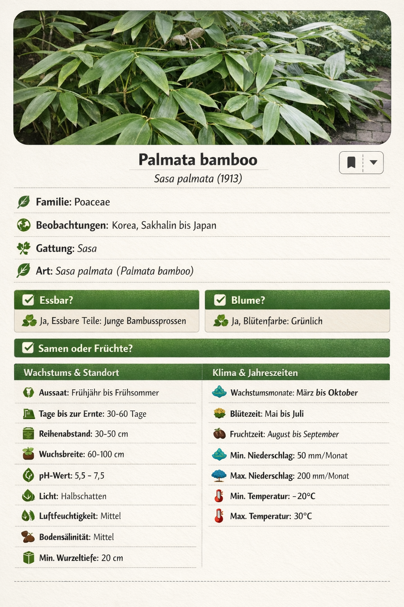
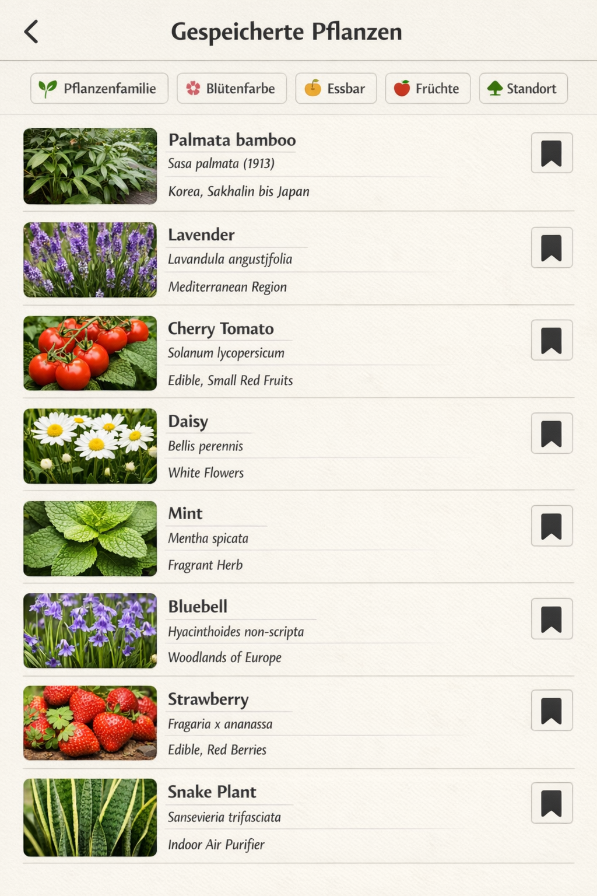
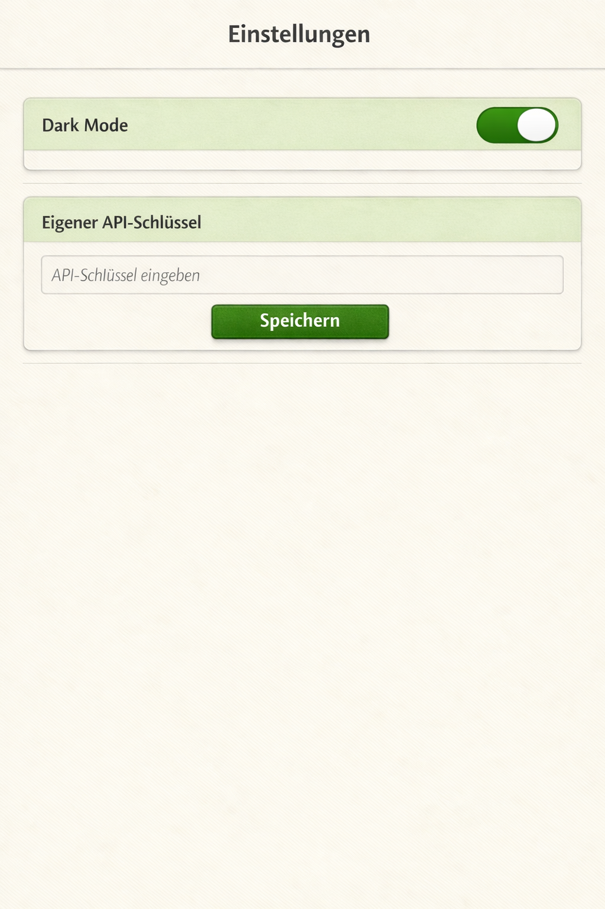

# Pflanzenbox (eng. Plant Box) 🪴

Pflanzenbox is a Mobile Frontend for the [Trefle API](https://trefle.io/) 🌻

I made this litte App for University ([DHGE](https://www.dhge.de/))

# Requirements

* 🛠️ [Flutter](https://flutter.dev/)
* 🪻 [Trefle API Key](https://trefle.io/)
* 📡 http Package (Add to Project with `dart pub add http`)

# Storyboard & Mockup

Mockup erstellt mit [Microsoft Copilot](https://copilot.cloud.microsoft/)

## Pflanzen suchen 🌻

* Als Nutzer möchte ich Pflanzen suchen können, um neue Pflanzen zu finden

## Pflanzen ansehen 👀

* Als Nutzer möchte ich mir Details einer Pflanzen ansehen können, um mehr über die Pflanze zu erfahren

## Pflanzen speichern ️💾

* Als Nutzer möchte ich mir Pflanzen aus der Suche speichern können, um nicht immer wieder neu suchen zu müssen und mir alle meine Pflanzen merken zu müssen
* Als Nutzer möchte ich Pflanzen auch entspeichern können, um alte Pflanzen die mich nicht mehr interessieren zu entfernen

## Einstellungen ⚙

* Als Nutzer möchte ich zwischen Light-Mode und Dark-Mode wechseln können, um die
* Als Entwickler sollte es die Möglichkeit geben meinen persönlichen API-Code für [Trefle](https://trefle.io) eingeben können, um keinen vorgegebenen API-Schlüssel im Code vorzugeben 📡

# Was nicht gehen wird 🥶

* Die Sprache auf eine andere Sprache als Englisch zu wechseln wird nicht möglich sein