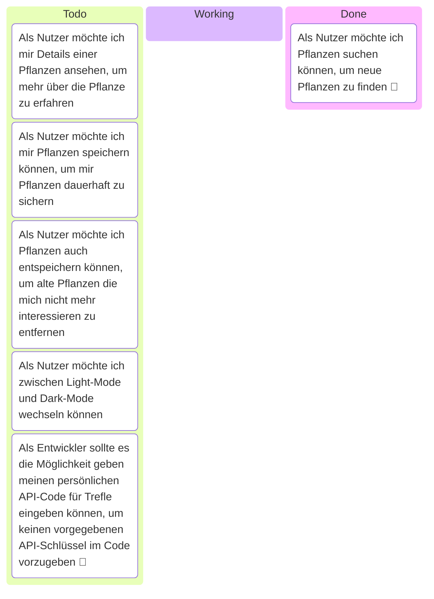

# Pflanzenbox (eng. Plant Box) 🪴

Pflanzenbox is a Mobile Frontend for the [Trefle API](https://trefle.io/) 🌻

I made this litte App for University ([DHGE](https://www.dhge.de/))

# Requirements

* 🛠️ [Flutter](https://flutter.dev/)
* 🪻 [Trefle API Key](https://trefle.io/)
* 📡 http Package (Add to Project with `dart pub add http shared_preferences`)

# Storyboard 🧩

# Mockup

Mockup erstellt mit [Microsoft Copilot](https://copilot.cloud.microsoft/)

