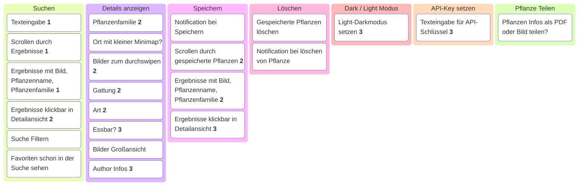
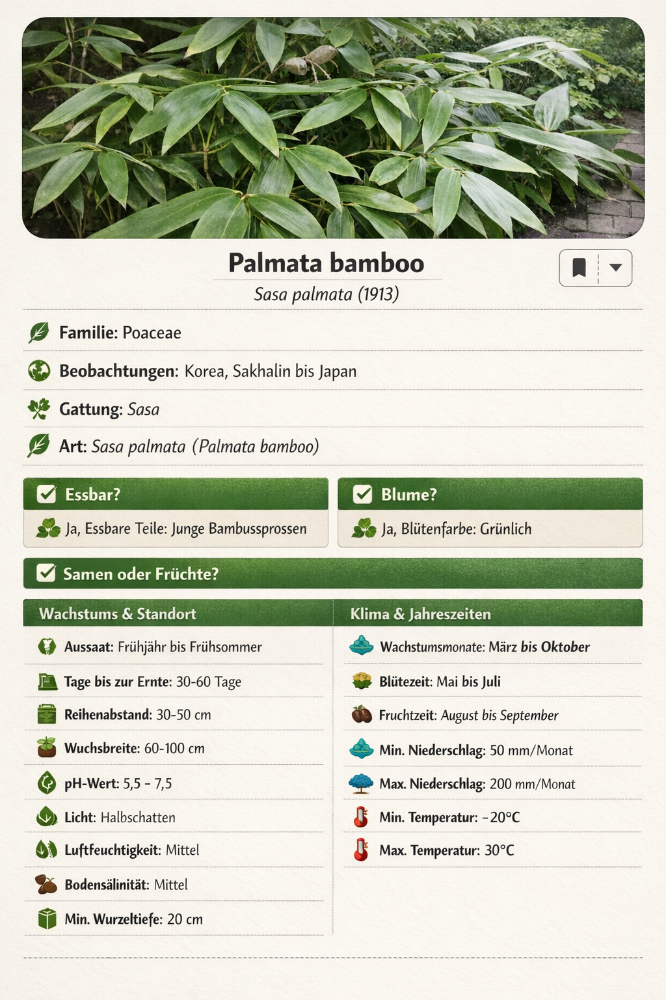
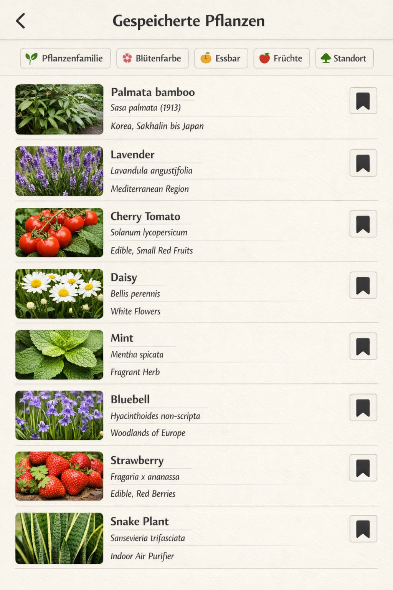
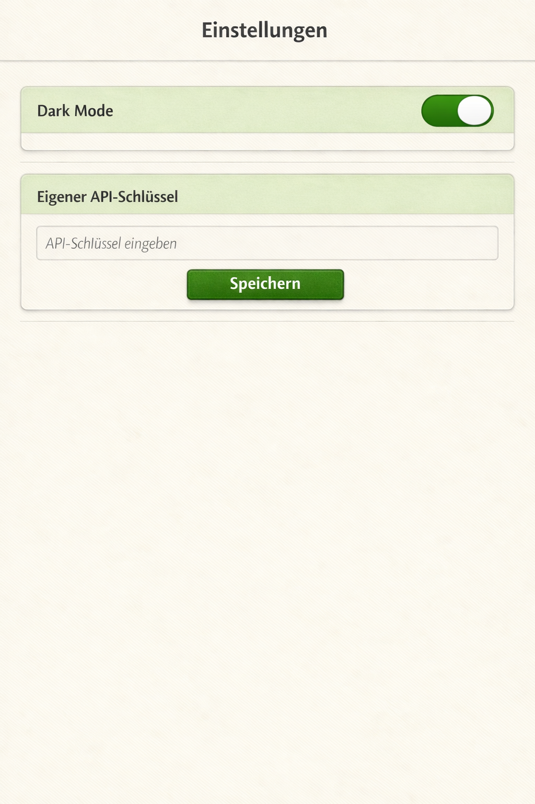

# Pflanzenbox (eng. Plant Box) 🪴

Pflanzenbox is a Mobile Frontend for the [Trefle API](https://trefle.io/) 🌻

I made this litte App for University ([DHGE](https://www.dhge.de/))

# Requirements

* 🛠️ [Flutter](https://flutter.dev/)
* 🪻 [Trefle API Key](https://trefle.io/)
* 📡 http Package (Add to Project with `dart pub add http shared_preferences cached_network_image flutter_launcher_icons`)
* Run `flutter pub get`

# Storyboard 🧩

> Aktuelles MVP: **3**

```mermaid
kanban
    columnSuchen[Suchen]
        task1[Texteingabe **1**]
        task2[Scrollen durch Ergebnisse **1**]
        task3[Ergebnisse mit Bild, Pflanzenname, Pflanzenfamilie **1**]
        task4[Ergebnisse klickbar in Detailansicht **2**]
        task5[Suche Filtern]
        task6[Favoriten schon in der Suche sehen]
    columnDetails[Details anzeigen]
        task1[Pflanzenfamilie **2**]
        task2[Ort mit kleiner Minimap?]
        task3[Bilder zum durchswipen **2**]
        task4[Gattung **2**]
        task5[Art **2**]
        task6[Essbar? **3**]
        task7[Bilder Großansicht]
        task8[Author Infos **3**]
    columnSpeichern[Speichern]
        task1[Notification bei Speichern]
        task2[Scrollen durch gespeicherte Pflanzen **2**]
        task3[Ergebnisse mit Bild, Pflanzenname, Pflanzenfamilie **2**]
        task4[Ergebnisse klickbar in Detailansicht **3**]
    columnLöschen[Löschen]
        task1[Gespeicherte Pflanzen löschen]
        task2[Notification bei löschen von Pflanze]
    columnLight[Dark / Light Modus]
        task1[Light-Darkmodus setzen **3**]
    columnApi[API-Key setzen]
        task1[Texteingabe für API-Schlüssel **3**]
    columnTeilen[Pflanze Teilen]
        task1[Pflanzen Infos als PDF oder Bild teilen?]
```

# Mockup 🖼️

Mockup erstellt mit [Microsoft Copilot](https://copilot.cloud.microsoft/)

